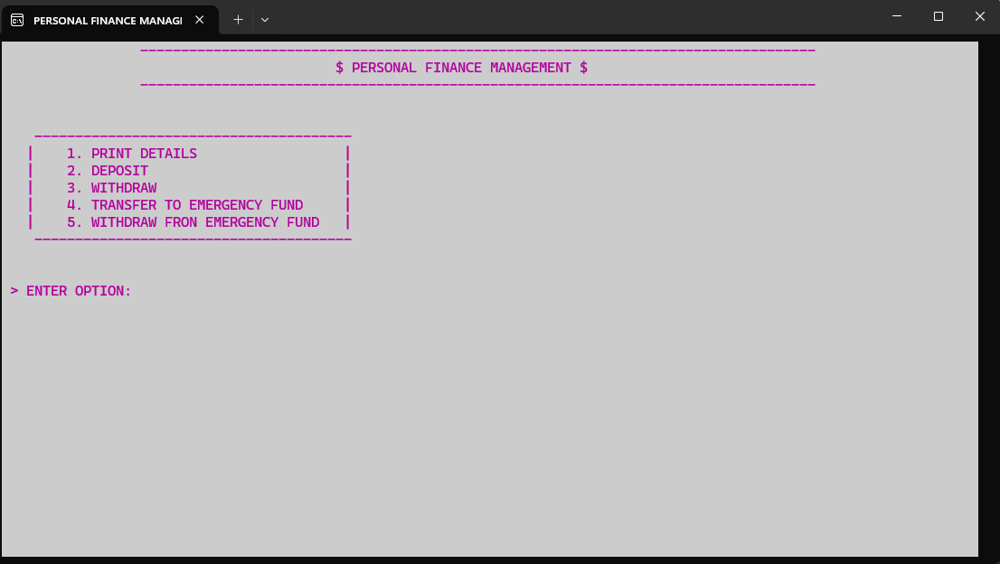
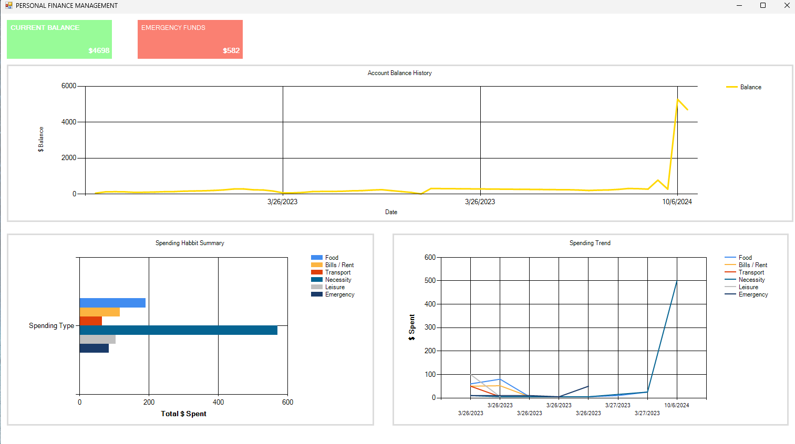

# Household Finance Management CLI Application
This application is a comprehensive tool designed for managing personal finances directly from the command line. Built with C++ for efficient processing, the CLI component allows users to perform essential financial operations. Additionally, a visualizer built with C# provides graphical insights into your financial habits, helping you understand your spending patterns and manage your finances better.

### CLI Application Features
- Record Money: Log income or new funds into your main System Account, ensuring all your earnings are tracked accurately.
- Withdraw Money: Take out money from the System Account for everyday expenses, capturing each transaction with ease.
- Transfer Money: Move funds from the System Account to an Emergency Account, facilitating better management of emergency reserves.

### Visualizer Features
- Current Balance Display: Shows real-time balances in the System and Emergency Accounts, allowing for immediate financial status checks.
- Emergency Funds Viewer: Dedicated view for monitoring the funds set aside for emergencies, ensuring you're prepared for unforeseen expenses.
- Line Graph of Spending Habits: Visualizes your spending over time, helping you spot trends and assess how your expenditures align with your financial goals.
- Bar Graph of Spending Types: Breaks down expenses by categories such as Food, Bills, and Rent, which is useful for budgeting and financial planning.
- Multi-Line Chart: Offers a detailed comparison of spending habits across different categories, highlighting how each sector contributes to your overall financial landscape.

---------------------------------------------------------------

#### CLI PROGRAM:

#### VISUALIZER PROGRAM:
